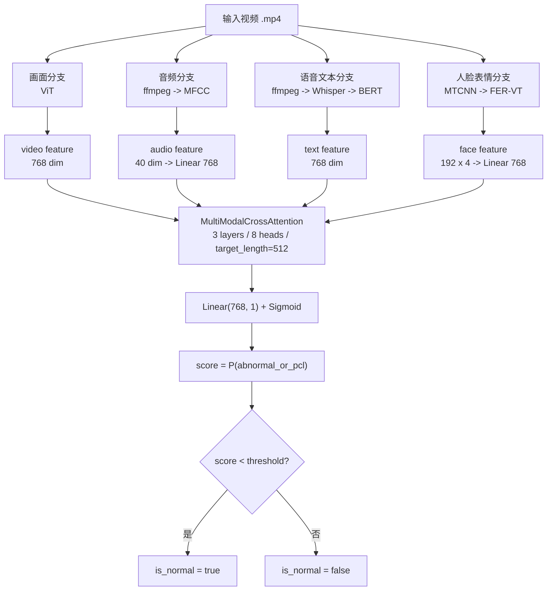

# 视频审核模型架构

当前视频审核后端基于 PCLMM 多模态模型，输入是一段 `.mp4` 视频，输出是否为正常视频：

```text
label 0 = normal_or_non_pcl
label 1 = abnormal_or_pcl

score = P(abnormal_or_pcl)
is_normal = score < threshold
```

接口默认只返回：

```json
{"is_normal": true}
```

## 架构图



## 1. 特征提取

模型使用四路特征：

```text
画面特征：ViT 提取视频帧视觉特征
音频特征：ffmpeg 抽取音频后提取 MFCC
语音文本特征：Whisper 语音识别，再用 BERT 提取文本语义特征
人脸表情特征：MTCNN 检测人脸，FER-VT 提取表情特征
```

运行时推荐使用 resident backend，在 API 启动时一次性加载 ViT、Whisper、BERT、MTCNN 和 FER-VT，避免每次请求重复加载模型。

## 2. 多模态融合模型

融合模型是 `MultiModalCrossAttention`：

```text
hidden size: 768
num heads: 8
num layers: 3
target length: 512
dropout: 0.5
```

四种模态会先对齐到同一维度，然后分别经过模态内 Transformer 编码，再进行两两 cross-attention：

```text
text-audio
text-video
text-face
audio-video
audio-face
video-face
```

融合后的四路表示相加，做 mean pooling，再经过 `Linear(768, 1)` 输出异常概率。

## 3. 推理执行方式

业务逻辑上，模型先提取四路特征，再做融合分类。

工程执行上，为了降低单视频返回延迟，特征提取可以并行：

```text
画面分支：ViT
音频分支：MFCC
语音文本分支：Whisper -> BERT
人脸分支：MTCNN -> FER-VT
```

其中 MFCC 和 Whisper 可以在音频准备完成后并行执行；BERT 依赖 Whisper 的识别文本，因此在 Whisper 之后执行。

## 4. API 输出

主要接口：

```text
GET  /health
POST /predict
```

`POST /predict` 接收 multipart `.mp4` 文件。普通模式只返回 `is_normal`，调试模式会额外返回 `score`、`threshold`、特征路径和耗时信息。

## 5. 主要运行资产

```text
融合模型 checkpoint:
  outputs/checkpoints/multi_modal_cross_attention_model.pth

ViT:
  pretrained/googlevit-base-patch16-224-in21k

BERT:
  pretrained/bert_chinese

FER-VT:
  pretrained/FER-VT

Whisper:
  运行时从 Whisper cache 加载
```

当前推荐 API 阈值：

```text
PCLMM_API_THRESHOLD=0.32
```

